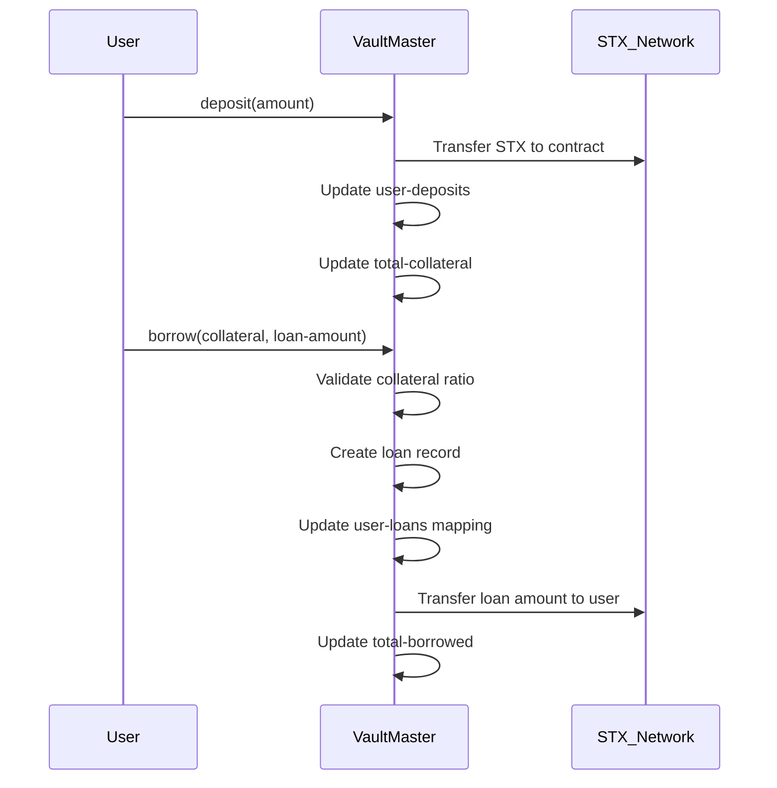
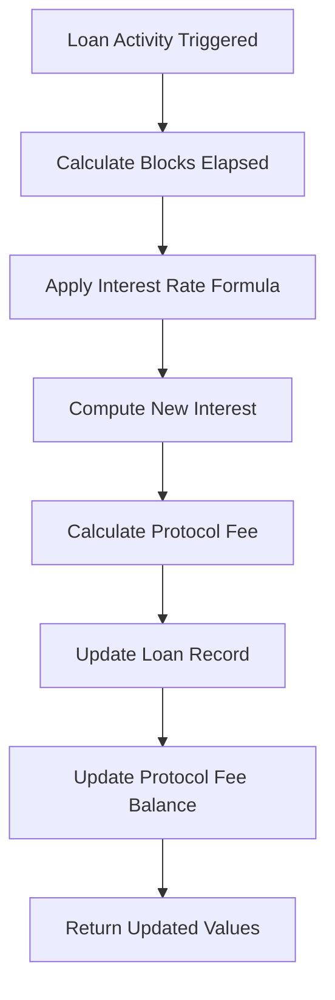
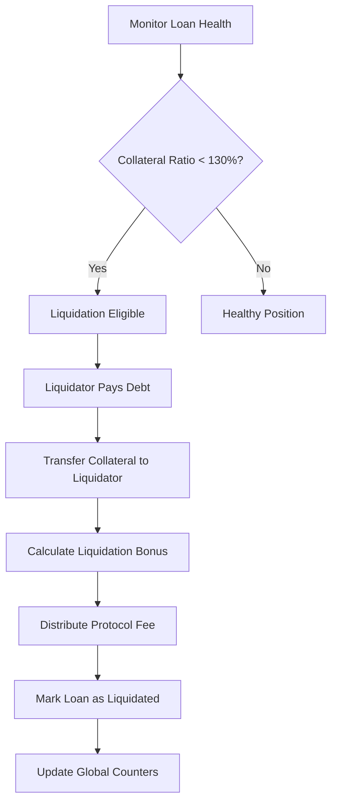

# VaultMaster Protocol

> **Advanced Collateral-Backed Lending Protocol on Stacks Blockchain**

VaultMaster is a cutting-edge decentralized finance (DeFi) protocol that enables users to unlock liquidity from their STX holdings through overcollateralized loans. Built with mathematical precision and security-first design principles, VaultMaster provides a robust infrastructure for decentralized lending with autonomous risk management.

## 🚀 Key Features

- **Overcollateralized Lending**: 150% minimum collateral ratio ensures protocol solvency
- **Dynamic Interest Calculation**: Block-based compound interest with real-time accrual
- **Autonomous Liquidation Engine**: Automated risk management with liquidator incentives
- **Protocol Revenue Distribution**: Sustainable fee structure for long-term viability
- **Emergency Controls**: Circuit breakers and pause functionality for enhanced security
- **Transparent Analytics**: Real-time on-chain position monitoring and health metrics

## 🏗️ System Overview

VaultMaster operates as a trustless lending protocol where users can:

1. **Deposit STX** as collateral into secure vaults
2. **Borrow against collateral** with configurable loan-to-value ratios
3. **Manage positions** through repayment and collateral adjustment
4. **Participate in liquidations** to earn rewards while maintaining protocol health

The protocol maintains system stability through:

- **Risk-based liquidation thresholds** (130% minimum health ratio)
- **Algorithmic interest rate calculations** based on Stacks block height
- **Protocol fee collection** from interest payments and liquidation bonuses
- **Multi-layer security controls** with administrative safeguards

## 📊 Contract Architecture

### Core Components

```
VaultMaster Protocol
├── Collateral Management
│   ├── Deposit System
│   ├── Withdrawal Controls
│   └── Balance Tracking
├── Loan Engine
│   ├── Position Creation
│   ├── Interest Calculation
│   └── Repayment Processing
├── Risk Management
│   ├── Health Monitoring
│   ├── Liquidation Engine
│   └── Threshold Management
├── Protocol Economics
│   ├── Fee Collection
│   ├── Revenue Distribution
│   └── Treasury Management
└── Analytics & Monitoring
    ├── Position Tracking
    ├── Health Metrics
    └── Market Statistics
```

### Data Structures

#### Primary Maps

- **`loans`**: Core loan position data with borrower, amounts, and status
- **`user-deposits`**: Individual user collateral balances
- **`user-loans`**: Mapping of users to their active loan IDs
- **`protocol-fees`**: Block-height indexed fee accumulation

#### State Variables

- **`loan-nonce`**: Sequential loan ID generation
- **`total-collateral`**: Global collateral tracking
- **`total-borrowed`**: Aggregate loan amounts
- **`paused`**: Emergency circuit breaker state

## 🔄 Data Flow

### Loan Creation Process



### Interest Calculation Flow



### Liquidation Process



## 🛡️ Security Architecture

### Multi-Layer Protection

1. **Mathematical Safeguards**
   - Overflow-protected arithmetic operations
   - Precision-based interest calculations
   - Ratio validation with safety margins

2. **Authorization Controls**
   - Role-based access control
   - Transaction sender verification
   - Administrative function restrictions

3. **Emergency Mechanisms**
   - Protocol pause functionality
   - Circuit breaker implementation
   - Emergency withdrawal controls

4. **Data Integrity**
   - Comprehensive error handling
   - State validation checks
   - Atomic transaction processing

## 📈 Economic Model

### Interest Rate Mechanics

- **Base Rate**: 5.0% APY (configurable)
- **Calculation**: Per-block compound interest
- **Protocol Fee**: 1.0% of interest payments
- **Block Frequency**: ~10 minute Stacks blocks

### Liquidation Incentives

- **Liquidation Threshold**: 130% collateral ratio
- **Liquidator Bonus**: 5% of collateral value
- **Protocol Share**: 50% of liquidation bonus
- **Remaining Collateral**: Returned to liquidator

### Risk Parameters

- **Minimum Collateral Ratio**: 150%
- **Liquidation Threshold**: 130%
- **Maximum Loan Duration**: Indefinite (with interest)
- **Maximum Loans per User**: 20 positions

## 🔧 Technical Specifications

### Requirements

- **Blockchain**: Stacks 2.0+
- **Language**: Clarity Smart Contract
- **Token Standard**: STX (native Stacks token)
- **Block Time**: ~10 minutes average

### Gas Optimization

- Efficient data structures for minimal storage costs
- Batch operations for multiple loan management
- Optimized mathematical operations
- Minimal external contract calls

### Integration Points

- **Frontend Integration**: Read-only functions for UI data
- **Analytics Services**: Protocol statistics and health metrics
- **Liquidation Bots**: Automated liquidation monitoring
- **Yield Farming**: Protocol fee distribution mechanisms

## 🧪 Testing & Verification

### Test Coverage Areas

- **Unit Tests**: Individual function validation
- **Integration Tests**: End-to-end loan lifecycle
- **Security Tests**: Overflow protection and access controls
- **Economic Tests**: Interest calculation and liquidation scenarios

### Audit Considerations

- Mathematical precision verification
- Access control validation
- State consistency checks
- Economic attack vector analysis

## 📚 Usage Examples

### Basic Loan Creation

```clarity
;; 1. Deposit collateral
(contract-call? .vaultmaster deposit u1000000) ;; 1 STX

;; 2. Create loan
(contract-call? .vaultmaster borrow u1000000 u650000) ;; 150% ratio
```

### Position Management

```clarity
;; Check loan health
(contract-call? .vaultmaster get-loan-health u1)

;; Repay loan
(contract-call? .vaultmaster repay-loan u1 u325000) ;; Partial repayment
```

### Liquidation Example

```clarity
;; Monitor and liquidate unhealthy position
(contract-call? .vaultmaster is-liquidatable u1)
(contract-call? .vaultmaster liquidate u1)
```

## 🤝 Contributing

VaultMaster is designed for community-driven development and improvement. Key areas for contribution:

- **Security Audits**: Independent security reviews
- **Feature Enhancements**: Additional lending mechanisms
- **Integration Tools**: Frontend libraries and SDKs
- **Documentation**: Usage guides and technical specifications

## 📄 License

This protocol is released under the MIT License. See LICENSE file for details.

## ⚠️ Disclaimer

VaultMaster is experimental DeFi infrastructure. Users should understand the risks involved with decentralized lending protocols, including but not limited to smart contract risks, liquidation risks, and market volatility impacts. Always conduct thorough due diligence before using any DeFi protocol.
